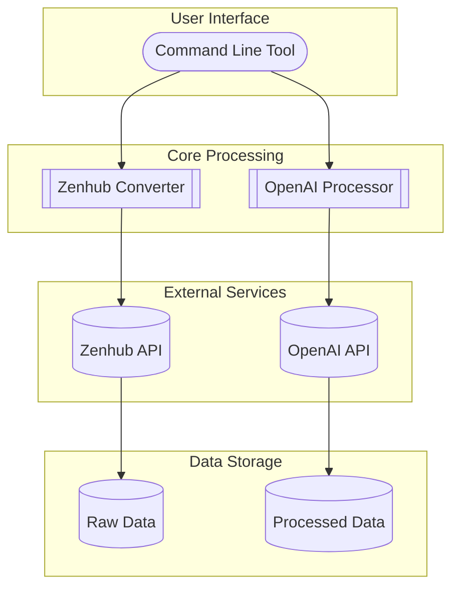

# zenhub-to-rag 🎯📚 (work-in-progress!!)

Convert Zenhub workspaces into RAG-optimized content for AI applications. This tool helps bridge the gap between project management and AI by making your Zenhub content queryable through RAG (Retrieval-Augmented Generation).

## Features ✨

- Extract comprehensive content from Zenhub workspaces including:
  - Issues and epics
  - Sprint and pipeline information
  - Estimates and dependencies
  - Labels and assignees
  - Issue relationships and hierarchies
- Convert to RAG-optimized format
- Rich metadata extraction for enhanced retrieval
- Optional OpenAI processing for enhanced documentation
- Comprehensive error handling and logging
- Progress tracking and detailed reports
- Multiple output formats

## System Architecture 🏗️



## Installation 🚀

### Using pip

```bash
pip install zenhub-to-rag
```

### Using Poetry (for development)

```bash
git clone https://github.com/yourusername/zenhub-to-rag.git
cd zenhub-to-rag
poetry install
```

## Setup 🔧

1. Get your Zenhub API token:
   - Log in to Zenhub (https://app.zenhub.com)
   - Go to Settings → App Settings
   - Click on "API Tokens"
   - Create new token
   - Copy the token immediately (you won't see it again!)

2. Find your Workspace ID:
   - Open your Zenhub workspace
   - The ID is in the URL: `https://app.zenhub.com/workspaces/YOUR_WORKSPACE_ID/board`

3. Set environment variables (optional):
```bash
export ZENHUB_TOKEN='your_zenhub_token'
export OPENAI_API_KEY='your_openai_key'  # Optional, for enhanced processing
```

## Usage 💻

### Basic Workflow

1. **Inspect a workspace**:
```bash
zenhub-to-rag inspect your_workspace_id
```

2. **Convert workspace content**:
```bash
zenhub-to-rag convert your_workspace_id --output-dir ./output
```

3. **Process with OpenAI** (optional):
```bash
zenhub-to-rag process ./output/data/your_workspace_id_raw.jsonl \
    --model gpt-4 \
    --output-dir ./output
```

4. **Generate statistics**:
```bash
zenhub-to-rag stats ./output/data/processed_content.jsonl -o stats.json
```

### Advanced Usage

#### Filtering Content
```bash
# Filter by pipeline
zenhub-to-rag convert your_workspace_id \
    --pipeline "Sprint Backlog" "In Progress"

# Filter by label
zenhub-to-rag convert your_workspace_id \
    --label bug feature

# Exclude epics or dependencies
zenhub-to-rag convert your_workspace_id \
    --no-epics \
    --no-dependencies
```

#### Processing Options
```bash
# Use specific OpenAI model
zenhub-to-rag process input.jsonl --model gpt-4

# Adjust batch size
zenhub-to-rag process input.jsonl --batch-size 3

# Increase retry attempts
zenhub-to-rag process input.jsonl --retry 5
```

## Output Format 📄

The tool generates JSONL files with RAG-optimized content:

```json
{
  "content": "Detailed issue description and documentation",
  "metadata": {
    "issue_number": 123,
    "title": "Issue title",
    "pipeline": "Sprint Backlog",
    "epic": "Q4 Features",
    "sprint": "Sprint 23",
    "estimate": 5,
    "labels": ["bug", "priority"],
    "assignees": ["username"],
    "dependencies": ["456", "789"],
    "created_at": "2024-01-01T00:00:00Z",
    "updated_at": "2024-01-02T00:00:00Z"
  }
}
```

## Directory Structure 📂

```
output/
├── data/
│   ├── workspace_raw.jsonl
│   ├── processed_content.jsonl
│   └── stats.json
└── logs/
    ├── convert_20240120_123456.log
    ├── process_20240120_123456.log
    └── error_20240120_123456.log
```

## Error Handling 🚨

The tool includes comprehensive error handling for:
- API rate limiting
- Network issues
- Processing failures
- Validation errors

Errors are logged to:
```
./output/logs/[command]_[timestamp].log
```

## Development 🛠️

### Setup

```bash
# Clone repository
git clone https://github.com/yourusername/zenhub-to-rag.git
cd zenhub-to-rag

# Install dependencies
poetry install

# Run tests
poetry run pytest

# Run with coverage
poetry run pytest --cov=zenhub_to_rag
```

### Running Tests

```bash
# All tests
poetry run pytest

# Specific test file
poetry run pytest tests/test_converter.py

# With coverage report
poetry run pytest --cov=zenhub_to_rag --cov-report=html
```

## Contributing 🤝

1. Fork the repository
2. Create your feature branch (`git checkout -b feature/AmazingFeature`)
3. Run tests (`poetry run pytest`)
4. Commit your changes (`git commit -m 'Add some AmazingFeature'`)
5. Push to the branch (`git push origin feature/AmazingFeature`)
6. Open a Pull Request

## Troubleshooting 🔍

### Common Issues

1. **"No access token provided"**
   ```bash
   export ZENHUB_TOKEN='your_token_here'
   # or
   zenhub-to-rag convert workspace_id --access-token your_token_here
   ```

2. **API Rate Limiting**
   ```bash
   # Try with smaller batch size
   zenhub-to-rag convert workspace_id --batch-size 3
   
   # Increase retry attempts
   zenhub-to-rag convert workspace_id --retry 5
   ```

3. **"Workspace not found"**
   - Check if the workspace ID is correct
   - Ensure you have access to the workspace
   - Try the inspect command first:
     ```bash
     zenhub-to-rag inspect your_workspace_id
     ```

### Limitations

- The tool currently only processes public repositories
- Some Zenhub features might require Enterprise access
- Rate limits apply based on your Zenhub plan
- OpenAI processing costs depend on your OpenAI plan

## License 📝

This project is licensed under the MIT License - see the [LICENSE](LICENSE) file for details.

## Support 💬

- 📫 For bugs and feature requests, please [open an issue](https://github.com/yourusername/zenhub-to-rag/issues)
- 💡 For questions and discussions, please use [GitHub Discussions](https://github.com/yourusername/zenhub-to-rag/discussions)
- 📖 Check out our [Wiki](https://github.com/yourusername/zenhub-to-rag/wiki) for additional documentation

## Acknowledgments 🙏

- Zenhub API Documentation
- OpenAI API
- The open-source community

---

*Note: This tool is not officially affiliated with Zenhub or OpenAI.*
